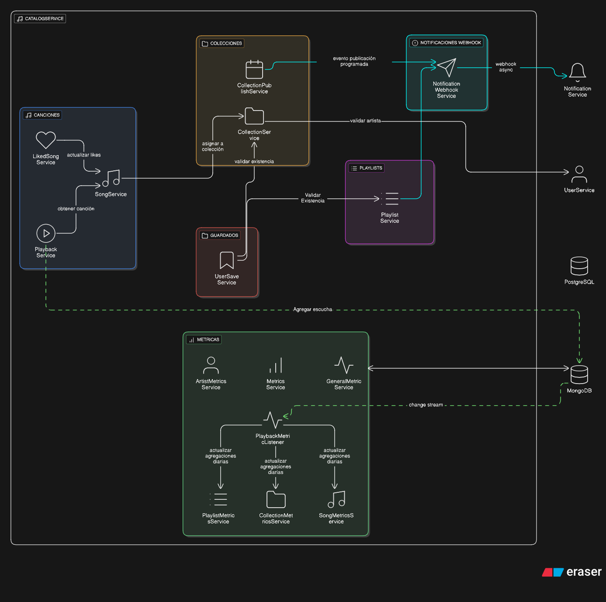

El servicio de catálogo es el componente responsable de gestionar el catálogo de contenido de la plataforma. Sus responsabilidades principales son:

- Gestión de [playlists y colecciones](Collections-Playlists.md)
- Gestión de [canciones](Canciones.md)
- Gestión de [likes](Canciones.md#sistema-de-likes)
- Gestión de [guardados](Collections-Playlists.md#guardados---usersaves)
- Gestión del [historial de reproducción](Reproducciones.md)
- Gestión de [métricas del catálogo](Metricas.md) de reproducción de canciones

## Vista General

En el siguiente diagrama se puede observar a grandes rasgos la arquitectura del servicio de catálogo:

> Link al diagrama para mayor claridad: [Arquitectura del Catalog Service](../assets/catalog-service-arq.png)

Se puede observar cómo el servicio de catálogo se comunica con el `User Service` para obtener información de los usuarios en algunos casos, como en el `Collection Service`, mediante HTTP requests. También utiliza webhooks para enviar notificaciones de eventos como la creación de una playlist o una nueva publicación de un artista.

Los servicios principales que tienen subservicios son:

- **Collection Service**: Gestiona las [colecciones](Collections-Playlists.md#colecciones) (ALBUM/EP/SINGLE)
- **Song Service**: Gestiona las [canciones](Canciones.md)
- **Like Service**: Gestiona los [likes](Canciones.md#sistema-de-likes)
- **Playlist Service**: Gestiona las [playlists](Collections-Playlists.md#playlists)
- **UserSave Service**: Gestiona los [guardados](Collections-Playlists.md#guardados---usersaves)
- **Playback Service**: Gestiona el [historial de reproducción y la reproducción](Reproducciones.md) de una canción
- **Metrics Service**: Gestiona las [métricas del servicio de catálogo](Metricas.md) de reproducción de canciones

> **Nota importante**: El servicio de métricas funciona como un servicio independiente dentro del servicio de catálogo, con su propia arquitectura y responsabilidades. Utiliza una arquitectura de dos niveles (eventos individuales y agregaciones diarias) para optimizar el rendimiento y proporciona APIs completas para consultar métricas de canciones, colecciones, playlists y artistas. Para más detalles sobre su arquitectura, flujo de captura, y APIs disponibles, ver [Métricas](Metricas.md).

## Bases de Datos

El servicio de catálogo utiliza dos bases de datos diferentes, cada una optimizada para su caso de uso específico:

- **PostgreSQL**: Base de datos principal del servicio de catálogo - almacena toda la información estructurada y relacional (colecciones, canciones, playlists, likes, guardados)
- **MongoDB**: Base de datos de métricas - almacena eventos de reproducción y métricas agregadas

Para más detalles sobre el diseño y las razones de esta elección, ver la sección de [Bases de Datos en Overview](../Overview.md#bases-de-datos).

## Comunicación entre Servicios

### Comunicación con User Service

El servicio de catálogo se comunica de forma **unidireccional** con el `User Service` mediante **HTTP requests síncronas** para obtener información adicional de usuarios cuando es necesario. Algunos casos de uso incluyen:

- Obtener los géneros favoritos de un usuario para personalizar recomendaciones
- Verificar información de seguidos/seguidores para mostrar contenido relevante
- Obtener datos del perfil de usuario para mostrar en el contexto del catálogo

Esta comunicación es unidireccional porque el servicio de catálogo solo consume información del servicio de usuarios, pero no le envía datos.

### Comunicación con Notification Service

El servicio de catálogo se comunica con el `Notification Service` mediante **webhooks** para enviar notificaciones de eventos importantes. Algunos eventos que se notifican incluyen:

- Creación de una nueva playlist
- Nueva publicación de un artista
- Eventos relevantes que requieren notificar a los usuarios

Esta comunicación es asíncrona mediante webhooks, lo que permite que el servicio de catálogo continúe procesando sin esperar a que se procesen las notificaciones.
