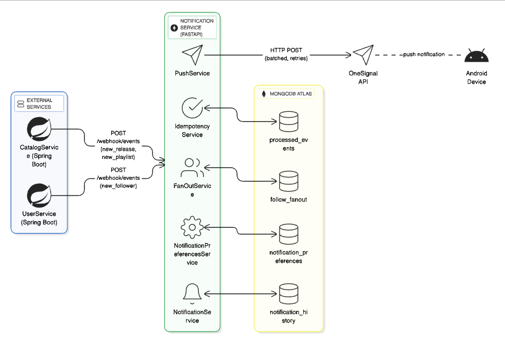

> [[index|← Volver al inicio]]

El servicio de notificaciones es el componente responsable de recibir eventos (webhooks o mensajes internos), transformarlos en notificaciones persistentes, exponer APIs para consulta y preferencias, y enviar notificaciones push a los usuarios mediante OneSignal. Sus responsabilidades principales son:

- Persistencia del historial de notificaciones.
- Gestión de preferencias por usuario.
- Entrega de notificaciones push.

## Arquitectura

El servicio de notificaciones emplea un sistema de tipo Webhook, el cual consiste en exponer un endpoint POST a los [[Servicio de usuarios|servicios de usuario]] y catalogo. Estos servicios funcionan como `producers` y el servicio de notificacion como `consumer`, ante eventos que puedan ocurrir. Estos eventos pueden ser:

- Creacion de una playlist.
- Creacion de una collection.
- [[Servicio de usuarios#Sistema de Follow/Unfollow|Nuevo seguidor]].

